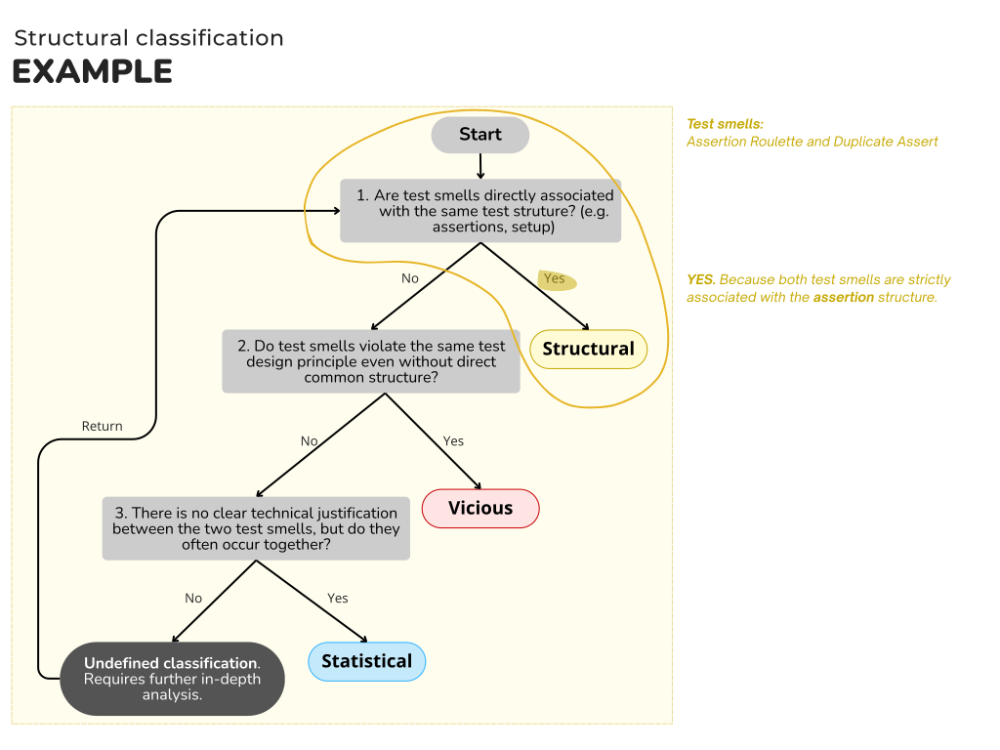

# 🗂️ Artifact Availability

This repository provides the main artifacts related to our study on test smell co-occurrence and refactoring strategies. The goal is to ensure transparency and reproducibility of the research process.

The following Figure provides an overview of the flow of steps adopted in this study. We suggest that it be consulted in parallel with Section 3.

## 📁 Artifacts Summary
**1. Systems used:** List of subject systems analyzed in the study.

**2. Test smell detection results:** Output data from test smell detection tools.

**3. Scripts and analysis results:** Scripts in Python used to process data and the corresponding analysis outputs.

**4. Co-occurrence classification:** Classification of test smell co-occurrence.

**5. Test smell co-occurrence refactoring:** Refactoring strategies for handling co-occurrence test smells.

-------------------

## 💿 1. Systems Used

We provide the following information for each system:

- Project name
- Commit hash used in the analysis
- Copy of the project (as cloned at the time of the study)
- A link to the original repository directory (for reference and reproducibility)

| N   | Project name | Commit | Original repository| 
| --- | ---          |---     |---                 |
| 1 | Accumulo | 47ac68d | https://github.com/apache/accumulo|
| 2 | AMDP | e8c1a62 | https://github.com/apache/maven-dependency-plugin |
| 3 | ASC | bc5867d |  https://github.com/adobe/asset-share-commons|
| 4 | Bookkeeper| f233320 | https://github.com/apache/bookkeeper |
| 5 | Cassandra | 6b13426 | https://github.com/apache/cassandra |
| 6 | Cayenne | 7e15607 | https://github.com/apache/cayenne |
| 7 | Cxf | 6b27aec |https://github.com/apache/cxf |
| 8 | DBeam | a8d3bc5 | https://github.com/spotify/dbeam |
| 9 | dble | e3a31b0 | https://github.com/actiontech/dble |
| 10 | etcd-java | 1fde9c0 | https://github.com/IBM/etcd-java |
| 11 | fb-jb-sdk | be6bc7b | https://github.com/facebook/facebook-java-business-sdk |
| 12 | gctoolkit | 4342691 | https://github.com/microsoft/gctoolkit |
| 13 | Guice | b0e1d0f | https://github.com/google/guice |
| 14 | Hive | 5160d3a | https://github.com/apache/hive |
| 15 | jcef | a414114 | https://github.com/JetBrains/jcef |
| 16 | jfnr | c9dbfee | https://github.com/cisco/jfnr |
| 17 | Joda Time | 290a451 | https://github.com/JodaOrg/joda-time
| 18 | JSqlParser | e47132a | https://github.com/discord/JSqlParser |
| 19 | kapua | 56adf32 | https://github.com/eclipse/kapua |
| 20 | Neptune Export | 632e0de | https://github.com/aws/neptune-export |
| 21 | Wicket | 48b1c3c | https://github.com/apache/wicket |
| 22 | Zookeeper | e454e8c | https://github.com/apache/zookeeper |

-------------------

## 🐞 2. Test smell detection results
This section provides the output data from the test smell detection tools. 
Each system was analyzed individually using our detection tool, and the results were stored in CSV format.

Each row in the CSV file represents a test method with at least one detected test smell. The columns provide both contextual and structural information, enabling traceability and support for further analysis (e.g., smell co-occurrence, refactoring opportunities).

| Column                | Description                                                                |
|-----------------------|----------------------------------------------------------------------------|
| `projectName`         | Name of the project analyzed                                               |
| `name`                | Test class name                                                            |
| `pathFile`            | Full path to the test file                                                 |
| `productionFile`      | Path to the corresponding production file                                  |
| `junitVersion`        | JUnit version used (e.g., JUnit4 or JUnit5)                                |
| `loc`                 | Lines of code in the test class                                            |
| `qtdMethods`          | Number of methods in the test class                                        |
| `testSmellName`       | Name of the detected test smell (e.g., *Verbose Test*)                     |
| `testSmellMethod`     | Name of the test method where the smell was found                          |
| `testSmellLineBegin`  | Starting line of the smelly method                                         |
| `testSmellLineEnd`    | Ending line of the smelly method                                           |
| `methodNameHash`      | Hash of the method name                                                    |
| `methodNameFullHash`  | Hash of the full method signature                                          |
| `methodCode`          | Source code of the test method (line breaks encoded)                       |
| `methodCodeHash`      | Hash of the method body                                                    |
| `FullHash`            | Unique identifier combining project, method, and test smell                |

## 📊 3. Scripts and analysis results

This section contains all the **scripts** in Python and **output files** used in the data analysis phase of the study.

#### Script1_CountTestClassesAndMethods.py
- **Objective:** Count statistics of Java projects related to tests, including: Number of .java files; Total lines of code; Total test classes; Total test methods (JUnit 3, 4 and 5).
- **Main functionality:** Goes through all projects located in a specific folder, identifies test classes (with @Test or extends TestCase), Detects test methods with regular expressions; Generates a CSV called "Result_CountTestClassesAndMethods.csv" with the metrics of each project.

#### Script2_Distribution.py
- **Objective:** Generate detailed distributions and summaries of test smells detected by project.
- **Main functionality:** For each project, reads files with results of automatic test smell detection and calculates: Total number of test smell instances; How many different types were detected; How many different classes and methods were affected; Distribution by classes and methods; Smells that occur on the same lines within the same class; Saves a *.txt report per project.

#### Script3_CouplesByClasses.py
- **Objective:** Analyze co-occurrence of test smell pairs within the same classes.
- **Main functionality:** Reads the same input files as the test smells. For each class, checks the types of smells present and counts combinations (pairs). Generates a CSV per project with co-occurrence counts of test smell pairs.

#### Script4_CouplesByMethods.py
- **Objective:** Calculate co-occurrence of pairs of test smells within the same test method, instead of within the same class (as in Script 3).
- **Main functionality:** Similar to Script 3, however the grouping is done at the test class level. It is checked whether a pair of test smells occur together in the same class.

#### Script5_Ranking.py
- **Objective:** Ranking of test smell co-occurrences.
- **Main functionality:** Given a CSV file containing a matrix of test smells and their corresponding co-occurrence frequencies, the script sorts these pairs from the most frequent to the least frequent.

-------------------

## 🏷️ 4. Co-occurrence classification

This section describes how we classified the co-occurrences of test smells found in three main categories.

-------------------
## 🔧 5. Test smell co-occurrence refactoring 

This section presents same examples and strategies for refactoring test methods affected by multiple test smells simultaneously. These refactorings aim to improve test quality while considering the interaction between co-occurrence test smells.
- Conditional Test Logic & Eager Test: [CTL_EgT.md](5_test_smell_co-occurrence_refactoring/CTL_EgT.md) 
- Duplicate Assert & Assertion Roulette: [DA_AR.md](5_test_smell_co-occurrence_refactoring/DA_AR.md)
- Duplicate Assert & Eager Test: [DA_EgT.md](5_test_smell_co-occurrence_refactoring/DA_EgT.md)
- Magic Number Test & Eager Test: [MNT_EgT.md](5_test_smell_co-occurrence_refactoring/MNT_EgT.md)
- Print Statement & Conditional Test Logic: [PS_CTL.md](5_test_smell_co-occurrence_refactoring/PS_CTL.md)
- Sleepy Test & Exception Handling: [ST_EH.md](5_test_smell_co-occurrence_refactoring/ST_EH.md)
- Sleepy Test & Eager Test: [ST_EgT.md](5_test_smell_co-occurrence_refactoring/ST_EgT.md)
- Sleepy Test & Magic Number Test: [ST_MNT.md](5_test_smell_co-occurrence_refactoring/ST_MNT.md)
- Sleepy Test & Verbose Test: [ST_VT.md](5_test_smell_co-occurrence_refactoring/ST_VT.md)
